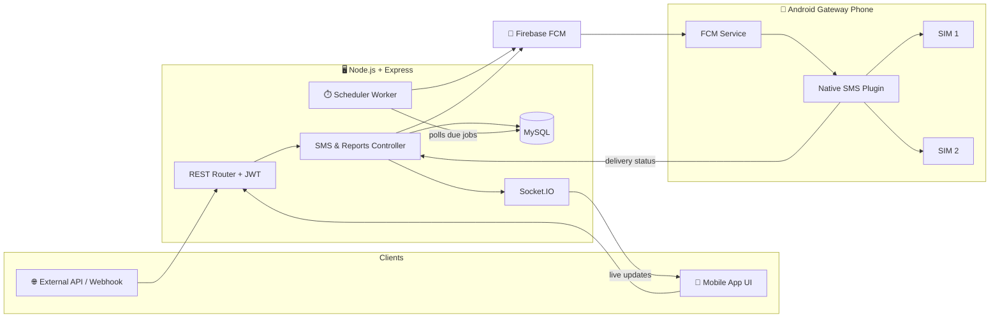
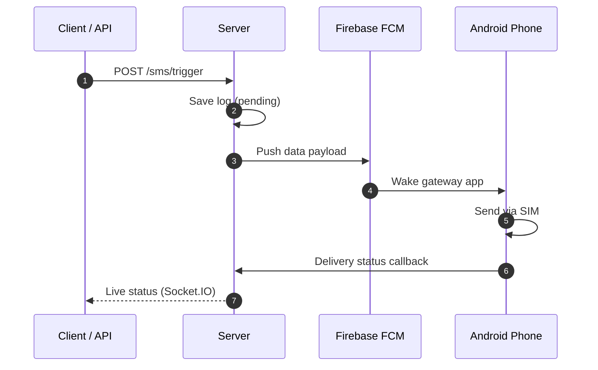

<div align="center">


<a href="https://github.com/">
  
</a>

<br/>

[](https://flutter.dev/)
[](https://nodejs.org/)
[](https://expressjs.com/)
[](https://www.mysql.com/)
[](https://firebase.google.com/)
[](#-license)

**[Quick Start](#-quick-start)** · **[Features](#-features)** · **[Architecture](#-architecture)** · **[Setup](#-full-setup-guide)** · **[API](#-api-reference)** · **[Deploy](#-production-tips)**

</div>

---

## 🌟 What is SMSMitra?

SMSMitra turns a regular **Android phone with a SIM card** into your own **SMS gateway server**. Send single, bulk, scheduled, or recurring SMS through a REST API or the mobile app, using your carrier's SMS pack instead of paying a cloud provider.

| 💡 Why SMSMitra | What you get |
| :--- | :--- |
| 💸 **No per-SMS gateway fees** | Skip Twilio / AWS SNS / MessageBird and use your carrier's plan |
| 📶 **Dual SIM & load balancing** | Daily limits, SIM priority, automatic load distribution |
| ⏰ **Built-in scheduler** | One-time and recurring (daily / weekly / monthly / interval) SMS |
| ⚡ **Real-time sync** | Socket.IO + Firebase Cloud Messaging for instant dispatch and live status |
| 🏷️ **White-label ready** | Rebrand and deliver to schools, clinics, agencies, and small businesses |

---

## 🚀 Quick Start

```bash
# 1️⃣ Backend
cd server && npm install && cp .env.example .env     # then edit .env
npm run dev

# 2️⃣ Mobile app (use a REAL Android phone with a SIM)
cd sms_app && flutter pub get && flutter run
```

> Before running, you still need to: create the MySQL database, add your Firebase files, and set the API URL. See the **[Full Setup Guide](#-full-setup-guide)**.

---

## ✨ Features

<div align="center">
  
</div>

---

## 🏛️ Architecture



<details>
<summary><b>🔄 How one SMS travels (click to expand)</b></summary>



</details>

<details>
<summary><b>📂 Project structure (click to expand)</b></summary>

```text
SMSMitra/
├── server/                        # Node.js + Express backend
│   ├── config/                    # db.js (Sequelize), firebase.js (Admin SDK)
│   ├── controllers/               # auth, frequent, schedule, sms
│   ├── models/                    # user, simdetail, smslog, scheduledsms, frequentsms
│   ├── routes/                    # API endpoints
│   ├── utils/                     # Scheduler worker, recurrence math, logger
│   ├── serviceAccountKey.json     # Firebase Admin credentials (keep private!)
│   ├── .env.example
│   └── index.js                   # Entry point + Socket.IO
│
└── sms_app/                       # Flutter Android gateway app
    ├── android/
    ├── assets/
    ├── local_plugins/sms_plugin/  # Native SIM & SMS MethodChannel
    ├── lib/
    │   ├── core/                  # Constants, theme, router, utils
    │   ├── data/                  # Dio API, Hive cache, storage, SMS services
    │   ├── features/              # auth · home · schedules · reports · settings · profile
    │   └── main.dart              # Entry + FCM background handler
    └── pubspec.yaml
```

</details>

---

## 🛠️ Prerequisites

| Tool | Minimum | Recommended |
| :--- | :--- | :--- |
| Node.js | 18.x | 20.x LTS |
| npm | 9.x | 10.x |
| MySQL / MariaDB | 8.0 / 10.5 | MySQL 8.0 |
| Flutter SDK | 3.22 | 3.29+ (Dart 3.x) |
| Android SDK | API 24 (Android 7.0) | Target SDK 34 |
| Java JDK | 17 | OpenJDK 17 |
| Firebase | Free Spark plan | - |

---

## 📦 Full Setup Guide

### 🖥️ Part 1: Backend (`server/`)

<details open>
<summary><b>1. Create the database</b></summary>

```sql
CREATE DATABASE smsmitra_db CHARACTER SET utf8mb4 COLLATE utf8mb4_unicode_ci;
```

</details>

<details open>
<summary><b>2. Install and configure</b></summary>

```bash
cd server
npm install
cp .env.example .env
```

Edit `.env`:

```ini
PORT=5000
NODE_ENV=production

DB_HOST=localhost
DB_NAME=smsmitra_db
DB_USER=root
DB_PASSWORD=your_mysql_password_here

JWT_SECRET=replace_with_a_long_random_string
JWT_EXPIRE=30d
```

</details>

<details open>
<summary><b>3. Add the Firebase Admin key</b></summary>

1. Open the [Firebase Console](https://console.firebase.google.com/) and select your project.
2. Go to **Project Settings ⚙️ → Service accounts → Generate new private key**.
3. Rename the file to `serviceAccountKey.json` and place it in `server/`.

> ⚠️ **Never commit this file.** Add `server/serviceAccountKey.json` and `.env` to `.gitignore`.

</details>

<details open>
<summary><b>4. Start the server</b></summary>

```bash
# Development (auto-reload)
npm run dev

# Production (PM2)
npm install -g pm2
pm2 start index.js --name "smsmitra-server"
pm2 save && pm2 startup
```

> 💡 Sequelize auto-creates all tables (`users`, `sim_details`, `sms_logs`, `scheduled_sms`, `frequent_sms`) on first boot.

</details>

### 📱 Part 2: Mobile App (`sms_app/`)

<details open>
<summary><b>1. Connect Firebase</b></summary>

1. In Firebase, add an **Android app** with package name `com.allysoftsolutions.smsmitra` (or your rebranded package).
2. Download `google-services.json` and place it at:
   ```text
   sms_app/android/app/google-services.json
   ```
3. If you use custom options, update `sms_app/lib/main.dart`:
   ```dart
   options: const FirebaseOptions(
     apiKey: "YOUR_FIREBASE_API_KEY",
     appId: "YOUR_FIREBASE_APP_ID",
     messagingSenderId: "YOUR_MESSAGING_SENDER_ID",
     projectId: "YOUR_FIREBASE_PROJECT_ID",
   )
   ```

</details>

<details open>
<summary><b>2. Set the backend URL</b></summary>

Edit `sms_app/lib/core/constants/api_constants.dart`:

```dart
class ApiConstants {
  // Production (HTTPS)
  static const String baseUrl = 'https://your-api-domain.com/smsmitra/v1';

  // Local development (use your computer's Wi-Fi IP)
  // static const String baseUrl = 'http://192.168.1.8:5000/smsmitra/v1';
}
```

</details>

<details open>
<summary><b>3. Run and build</b></summary>

```bash
cd sms_app
flutter pub get
flutter pub run build_runner build --delete-conflicting-outputs   # optional

flutter run -d <your-device-id>        # debug on a real phone
flutter build apk --release            # release APK
```

Release output: `sms_app/build/app/outputs/flutter-apk/app-release.apk`

> ⚠️ **Use a physical Android phone with an active SIM.** Emulators cannot send SMS or detect SIM cards.

</details>

---

## 🎮 First-Time Use

| Step | Action |
| :---: | :--- |
| **1** | Open the app → **Register** an admin account → **Log in** |
| **2** | Grant permissions: **Send/View SMS**, **Phone state / calls**, **Notifications** |
| **3** | The app detects SIM 1 / SIM 2 → set **daily limit** (e.g. 100/day) and **priority** → **Save SIM Configuration** |
| **4** | Disable battery optimization (below) |
| **5** | Test: **Home → Quick SMS** → enter number and message → **Send SMS** |

<details>
<summary><b>🔋 Battery optimization (essential for 24/7 gateways)</b></summary>

1. **Settings → Apps → SMSMitra → Battery → Unrestricted / Don't optimize**
2. Enable **Autostart / Run in background** (Xiaomi, Oppo, Vivo, Samsung).

Without this, Android may put the app to sleep and delay or drop SMS dispatch.

</details>

---

## 📡 API Reference

**Base URL:** `/smsmitra/v1`

| Method | Endpoint | Purpose |
| :---: | :--- | :--- |
| `POST` | `/auth/register` | Create an account |
| `POST` | `/auth/login` | Get a JWT token |
| `POST` | `/sms/trigger` | Send an SMS via the gateway phone |
| `POST` | `/sms/sync` | Sync SIM details |
| `GET` | `/sms/reports/:userId?page=1&limit=20` | Delivery logs |
| `GET` | `/sms/reports/stats?userId=1` | Aggregate stats |
| `POST` | `/schedules` | Create a one-time scheduled SMS |
| `POST` | `/frequent` | Create a recurring SMS rule |
| `PATCH` | `/frequent/:id/toggle` | Toggle a rule between `active` and `paused` |

<details>
<summary><b>🔐 Auth examples</b></summary>

**Register** → `POST /auth/register`
```json
{ "name": "Admin User", "email": "admin@example.com", "password": "SecurePassword123" }
```

**Login** → `POST /auth/login`
```json
{ "email": "admin@example.com", "password": "SecurePassword123" }
```
Response:
```json
{
  "success": true,
  "token": "eyJhbGciOiJIUzI1NiIsInR5cCI6IkpXVCJ9...",
  "user": { "id": 1, "name": "Admin User", "email": "admin@example.com" }
}
```

</details>

<details open>
<summary><b>📩 Send an SMS</b></summary>

```bash
curl -X POST https://your-api-domain.com/smsmitra/v1/sms/trigger \
  -H "Content-Type: application/json" \
  -H "Authorization: Bearer <your_jwt_token>" \
  -d '{
    "userId": 1,
    "receiverNumber": "+919876543210",
    "message": "Hello! Your verification code is 482910.",
    "simId": "sim_slot_0"
  }'
```

Response:
```json
{ "success": true, "message": "SMS dispatch initiated successfully", "logId": 105 }
```

</details>

<details>
<summary><b>🔁 Sync SIM details</b></summary>

`POST /sms/sync`
```json
{
  "userId": 1,
  "sims": [
    {
      "simId": "sim_slot_0",
      "carrierName": "Jio 4G",
      "slotIndex": 0,
      "dailyLimit": 100,
      "priority": 1,
      "isActive": true
    }
  ]
}
```

</details>

<details>
<summary><b>⏰ Scheduling examples</b></summary>

**One-time** → `POST /schedules`
```json
{
  "userId": 1,
  "receiverNumber": "+919876543210",
  "message": "Reminder: Your appointment is tomorrow at 10 AM.",
  "scheduledAt": "2026-10-01T10:00:00.000Z",
  "simId": "sim_slot_0"
}
```

**Recurring** → `POST /frequent`
```json
{
  "userId": 1,
  "title": "Daily Morning Motivation",
  "receiverNumber": "+919876543210",
  "message": "Good morning! Have a productive day ahead.",
  "frequencyType": "DAILY",
  "dispatchTime": "09:00",
  "frequencyConfig": { "daysOfWeek": [1, 2, 3, 4, 5] }
}
```

`frequencyType` options: `DAILY` · `WEEKLY` · `MONTHLY` · `INTERVAL`

</details>

---

## ⚡ Command Cheat Sheet

<table>
<tr>
<td valign="top" width="50%">

**🖥️ Backend**

| Command | Action |
| :--- | :--- |
| `npm run dev` | Dev server (Nodemon) |
| `npm start` | Standard start |
| `pm2 status` | Check PM2 processes |
| `pm2 logs smsmitra-server` | Live logs |
| `pm2 restart smsmitra-server` | Restart |

</td>
<td valign="top" width="50%">

**📱 Mobile**

| Command | Action |
| :--- | :--- |
| `flutter pub get` | Fetch dependencies |
| `flutter run` | Debug on device |
| `flutter build apk --release` | Release APK |
| `flutter build appbundle --release` | Play Store `.aab` |
| `flutter clean` | Clear build cache |

</td>
</tr>
</table>

---

## 🛡️ Production Tips

- 🔐 **HTTPS everywhere:** put Express behind **Nginx + Let's Encrypt** so REST and WebSockets (`wss://`) are encrypted.
- 💾 **Daily DB backups:**
  ```bash
  mysqldump -u root -p smsmitra_db > /backups/smsmitra_$(date +%F).sql
  ```
- 🔌 **Dedicated gateway phone:** keep it on constant power with stable Wi-Fi or 4G/5G.
- 🙈 **Protect secrets:** keep `.env` and `serviceAccountKey.json` out of version control.

---

## 🩺 Troubleshooting

| Problem | Likely fix |
| :--- | :--- |
| SIMs not detected | Use a real phone (not an emulator) and grant the phone-state permission |
| SMS delayed or not sent when the screen is off | Set battery to **Unrestricted** and enable Autostart |
| App can't reach the server | Check `baseUrl`; on local Wi-Fi use your computer's LAN IP, not `localhost` |
| Push trigger never arrives | Verify `google-services.json` and `serviceAccountKey.json` belong to the same Firebase project |

---

## 📄 License

**Commercial license.**

- ✅ Modify, rebrand, and host for personal, agency, or client projects.
- ❌ Reselling the raw source as-is on public marketplaces without substantial proprietary modification is prohibited.
- 🤝 For support, custom work, or enterprise white-label integrations, contact your authorized vendor.

---

<div align="center">

**SMSMitra** · Engineered with ❤️ for reliable mobile SMS automation


</div>