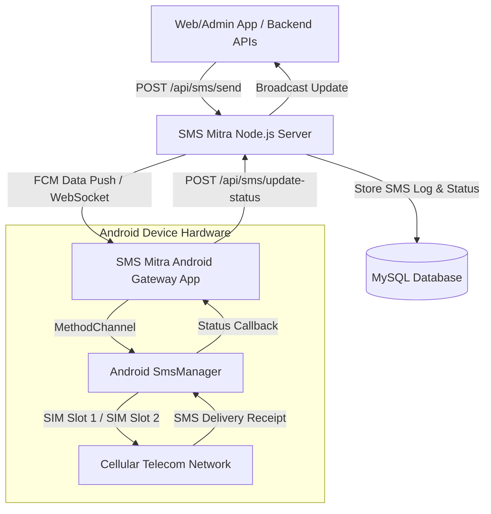

# 📱 SMS Mitra — Enterprise Mobile SMS Gateway & Dispatch System

[](https://flutter.dev)
[](https://dart.dev)
[](https://nodejs.org)
[](https://expressjs.com)
[](https://mysql.com)
[](https://firebase.google.com)
[](https://riverpod.dev)

**SMS Mitra** is an enterprise-grade, cost-effective SMS Gateway platform that transforms physical Android smartphones into powerful outbound SMS dispatch engines. It eliminates costly third-party SMS aggregator fees by routing cloud dispatch tasks through your local dual-SIM cellular subscriptions with automated quota management, real-time status reporting, and background resilience.

---

## 📑 Table of Contents

1. [Architecture Overview](#-architecture-overview)
2. [Key Features](#-key-features)
3. [Project Structure](#-project-structure)
4. [Prerequisites](#-prerequisites)
5. [Backend Server Setup](#-backend-server-setup)
6. [Flutter Client App Setup](#-flutter-client-app-setup)
7. [Android Device & Permissions Guide](#-android-device--permissions-guide)
8. [Testing & Code Quality](#-testing--code-quality)
9. [API & Dispatch Endpoints](#-api--dispatch-endpoints)
10. [Troubleshooting & FAQs](#-troubleshooting--faqs)

---

## 🏗 Architecture Overview

The system operates via a decoupled client-server architecture:



1. **Cloud API Dispatch**: Your applications trigger SMS requests through the SMS Mitra REST API.
2. **Instant Push**: The server dispatches the job to the dedicated Android device via high-priority Firebase Cloud Messaging (FCM) or real-time WebSockets.
3. **Native Carrier Dispatch**: The Flutter application invokes native Android `SmsManager` across multi-SIM hardware slots with slot priority routing.
4. **Real-time Reconciliation**: Delivery statuses (`sent`, `failed`, `pending`) and error logs are synced back to the server and cached locally in Hive.

---

## ✨ Key Features

- 📶 **Multi-SIM Support & Dynamic Priority**: Auto-detects all available SIM cards, carrier names, and slot IDs. Reorder SIM priority dynamically with drag-and-drop.
- ⚡ **Dual Dispatch Channels**: High-priority Firebase Cloud Messaging (FCM) for background wakeup + low-latency WebSockets for instant foreground sync.
- 📊 **Strict Quota & Limit Enforcement**: Configure per-SIM daily or monthly dispatch limits (e.g. 100/day or unlimited) with real-time UI warning badges and automated overflow prevention.
- 📑 **PDF Export & Detailed Analytics**: Filter SMS history by date range, SIM carrier, or status, and generate formatted PDF reports ready for export or printing.
- 🛡 **Robust Error Handling & Auto-Retry**: Built with typed domain exceptions (`AppException`, `NetworkException`, `AuthException`, `QuotaException`), transient error retry interceptor with exponential backoff, and sanitized token logging.
- 📴 **Offline-First Resilience**: Local caching via Hive and encrypted credential storage via `flutter_secure_storage`.
- 🔋 **Background Execution Reliability**: Built-in system battery optimization bypass and Google Play Protect guidance to ensure uninterrupted message processing.

---

## 📂 Project Structure

```
SMSMitra/
├── server/                          # Node.js Express REST API & WebSocket Server
│   ├── config/                      # Database (Sequelize) & Firebase Admin Config
│   ├── controllers/                 # Auth, SMS, Device, and Report Controllers
│   ├── models/                      # Sequelize Models (User, SMSLog, Device, etc.)
│   ├── routes/                      # Express Route Definitions
│   ├── utils/                       # Token generation, helpers, and FCM dispatcher
│   ├── index.js                     # Application Entry Point & Socket.IO initialization
│   ├── package.json
│   └── .env.example
│
└── sms_app/                         # Flutter Client Gateway Application
    ├── lib/
    │   ├── core/                    # Constants, App Tokens, Errors, Helpers, Theme, Routes
    │   │   ├── constants/           # ApiConstants, StorageKeys
    │   │   ├── errors/              # Domain Exceptions (AppException, NetworkException, etc.)
    │   │   ├── helpers/             # ValidationHelper, MessageHelper, DialogHelper
    │   │   ├── routes/              # GoRouter configuration & route guards
    │   │   └── theme/               # Design tokens (AppSpacing, AppRadius, AppColors)
    │   ├── data/                    # Data Layer
    │   │   ├── cache/               # Hive Caching & CacheManager
    │   │   ├── models/              # UserModel, SettingsModel, SimModel, SmsLogModel
    │   │   ├── providers/           # Riverpod Service Providers (DI Layer)
    │   │   ├── repositories/        # AuthRepository & Repository Interfaces
    │   │   └── services/            # ApiService, SimService, SmsService, StorageService
    │   ├── features/                # Presentation Layer (Feature-Driven)
    │   │   ├── auth/                # Login, Register screens & AuthNotifier
    │   │   ├── home/                # Dashboard, Stats, Quick Send & HomeNotifier
    │   │   ├── profile/             # Profile management & Logout
    │   │   ├── reports/             # Filterable reports, logs table & PDF export
    │   │   ├── settings/            # SIM priority, limits, permissions & theme
    │   │   └── splash/              # Animated Splash & Session routing
    │   ├── shared/                  # Reusable UI Design System Components
    │   │   └── widgets/             # StatCard, StatusBadge, EmptyState, CustomTextField, etc.
    │   └── main.dart                # Global error handlers & FCM background receiver
    ├── test/                        # Automated Unit, Widget & DI Test Suite (43+ Tests)
    ├── pubspec.yaml
    └── analysis_options.yaml        # Strict Analyzer & Production Linter Rules
```

---

## 📋 Prerequisites

Before running the project, ensure you have the following installed:

1. **Flutter SDK**: `v3.24.0` or higher ([Download Flutter](https://flutter.dev/docs/get-started/install))
2. **Dart SDK**: `v3.5.0` or higher
3. **Node.js**: `v18.x` or higher ([Download Node.js](https://nodejs.org))
4. **MySQL Database**: `v8.x` running locally or on a cloud instance
5. **Android Device**: Physical Android smartphone running Android 8.0 (API 26) or higher with active SIM cards inserted. *(Note: Telephony/SMS features require real SIM hardware and will not work on standard emulators).*
6. **Firebase Account**: A Firebase project configured for Cloud Messaging.

---

## 🚀 Backend Server Setup

### 1. Install Dependencies
```bash
cd server
npm install
```

### 2. Configure Environment Variables
Copy `.env.example` to `.env` and fill in your details:
```bash
cp .env.example .env
```

Edit `server/.env`:
```env
PORT=5000
NODE_ENV=development

# MySQL Database Configuration
DB_HOST=localhost
DB_NAME=smsmitra_db
DB_USER=root
DB_PASSWORD=your_mysql_password

# JWT Authentication
JWT_SECRET=your_super_secret_jwt_key_here
JWT_EXPIRE=30d
```

### 3. Setup Firebase Admin SDK
1. Go to **Firebase Console** -> **Project Settings** -> **Service Accounts**.
2. Click **Generate new private key** and download the JSON file.
3. Rename the file to `serviceAccountKey.json` and place it in the `server/` root directory:
   ```
   server/serviceAccountKey.json
   ```

### 4. Create MySQL Database
Ensure your MySQL instance is running, then create the database:
```sql
CREATE DATABASE smsmitra_db CHARACTER SET utf8mb4 COLLATE utf8mb4_unicode_ci;
```

### 5. Start the Server
```bash
# Development mode with hot-reload
npm run dev

# Or production mode
npm start
```
The server will automatically synchronize Sequelize tables and listen on `http://localhost:5000`.

---

## 📱 Flutter Client App Setup

### 1. Configure Backend Server URL
Open [lib/core/constants/api_constants.dart](file:///e:/Allysoft%20solutions/SMSMitra/sms_app/lib/core/constants/api_constants.dart) and update the base URL to your server's IP address (or domain):

```dart
class ApiConstants {
  // Replace with your local machine's IP address (e.g. http://192.168.1.100:5000/smsmitra/v1)
  static const String baseUrl = 'http://YOUR_LOCAL_IP:5000/smsmitra/v1';
  ...
}
```
> [!TIP]
> Do NOT use `localhost` or `127.0.0.1` when running on a physical Android phone, as the phone cannot resolve your computer's loopback interface. Use your computer's local Wi-Fi IP address (e.g., `192.168.x.x`).

### 2. Install Flutter Dependencies
```bash
cd sms_app
flutter pub get
```

### 3. Generate Hive Adapters
Run `build_runner` to generate type adapters:
```bash
flutter pub run build_runner build --delete-conflicting-outputs
```

### 4. Connect Physical Android Device & Run
Enable **Developer Options** and **USB Debugging** on your Android smartphone, plug it in via USB, and run:
```bash
# Check connected devices
flutter devices

# Run the app in debug mode
flutter run -d <DEVICE_ID>
```

---

## ⚙️ Android Device & Permissions Guide

To guarantee 100% reliable background SMS dispatching on modern Android OS versions, execute these quick configuration steps on your gateway device:

### 1. Grant Runtime Permissions
When launching the app for the first time, allow all requested permissions:
- **SMS Permissions**: `SEND_SMS`, `READ_SMS`, `RECEIVE_SMS` (Required for dispatch).
- **Phone State Permission**: `READ_PHONE_STATE` (Required to detect SIM slot indices and carrier info).
- **Notifications**: Required for FCM foreground and background triggers.

### 2. Disable Battery Optimization (Background Alive)
Manufacturers (Xiaomi, Samsung, Oppo, Vivo, OnePlus) aggressively terminate background processes.
1. Open **Settings** -> **Battery** -> **App Battery Usage** / **Battery Optimization**.
2. Locate **SMS Mitra** and select **"Unrestricted" / "Don't Optimize"**.
3. In app, go to **Settings** screen and verify **Battery Saver** shows a green checkmark.

### 3. Disable Google Play Protect Scanning (For Sideloaded Gateway Builds)
Google Play Protect flags sideloaded APKs requesting `SEND_SMS` permissions and may suppress background workers:
1. Open **Google Play Store**.
2. Tap your profile icon (top-right) -> **Play Protect**.
3. Tap **Settings (Gear Icon)** in top-right.
4. Turn **OFF** *"Scan apps with Play Protect"* and *"Improve harmful app detection"*.

---

## 🧪 Testing & Code Quality

The codebase enforces strict static analysis (`strict-casts`, `strict-inference`, `strict-raw-types`) and includes a comprehensive test suite.

### Run Static Analysis
```bash
cd sms_app
flutter analyze
```
*Expected output: `No issues found!` (0 errors, 0 warnings).*

### Run Automated Unit & Widget Test Suite
```bash
cd sms_app
flutter test
```
*Test coverage covers 43+ automated tests across:*
- **Error Handling**: Domain exception mappings, Dio error interceptors, HTTP status code translation.
- **Navigation**: Declarative GoRouter auth guards, deep linking, custom 404 screens, RouteObservers.
- **Validation**: RFC regex email, 10-digit mobile formatting with international prefixes, SMS limit boundaries.
- **Widget Lifecycle & Safety**: Memory leak safety, focus nodes, stream subscriptions, and unmount checks.
- **Design Tokens & UI**: Reusable `StatCard`, `StatusBadge`, `EmptyStateWidget`, `ConfirmBottomSheet`.
- **Dependency Injection**: Riverpod service provider overrides and mock isolation.

---

## 🔌 API & Dispatch Endpoints

### Authentication
- `POST /smsmitra/v1/auth/register` — Register a new organization/user account.
- `POST /smsmitra/v1/auth/login` — Authenticate and retrieve JWT token.
- `POST /smsmitra/v1/auth/update-token` — Update device FCM push token.
- `POST /smsmitra/v1/auth/update-profile` — Update account profile details.

### SIM & Gateway Operations
- `POST /smsmitra/v1/sms/sync-sims` — Sync detected physical SIM cards and configured quota limits.
- `POST /smsmitra/v1/sms/create-log` — Create manual or external SMS dispatch log.
- `POST /smsmitra/v1/sms/update-status` — Update SMS dispatch status (`sent`, `failed`, `pending`).

### Reports & Analytics
- `GET /smsmitra/v1/reports/stats?userId=:id` — Fetch daily summary counts (Sent Today, Failed Today).
- `GET /smsmitra/v1/reports/detailed` — Fetch filtered logs (by `startDate`, `endDate`, `simId`, `channel`).

---

## ❓ Troubleshooting & FAQs

#### Q1: Why are SMS messages not sending in the background?
- **Battery Optimization**: Ensure battery optimization is disabled ("Unrestricted") for SMS Mitra.
- **Play Protect**: Disable Google Play Protect scanning on the phone as explained above.
- **FCM Setup**: Verify that your `google-services.json` on the client and `serviceAccountKey.json` on the server belong to the exact same Firebase project.

#### Q2: The app shows `Connection timeout` or `NetworkException`.
- Verify your smartphone and backend computer are on the same local Wi-Fi network.
- Confirm that your computer's firewall allows incoming connections on port `5000`.
- Double-check the IP address specified in `lib/core/constants/api_constants.dart`.

#### Q3: SIM cards are not detected.
- Verify the device has active SIM cards inserted and cellular network bars are visible.
- Ensure the **Phone State** (`READ_PHONE_STATE`) permission is granted in Android App Settings.

---

## 📄 License

This project is licensed under the [ISC License](LICENSE).

Developed by the **Ally Soft Solutions**.